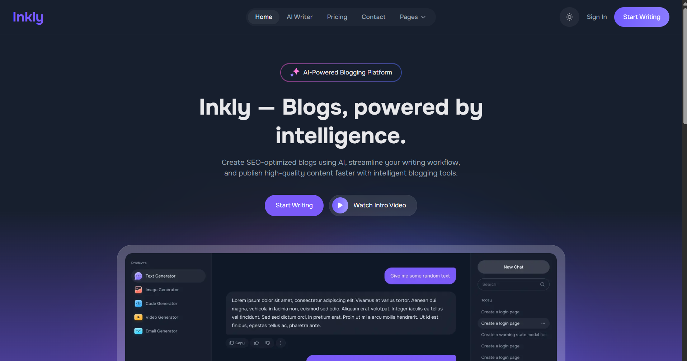
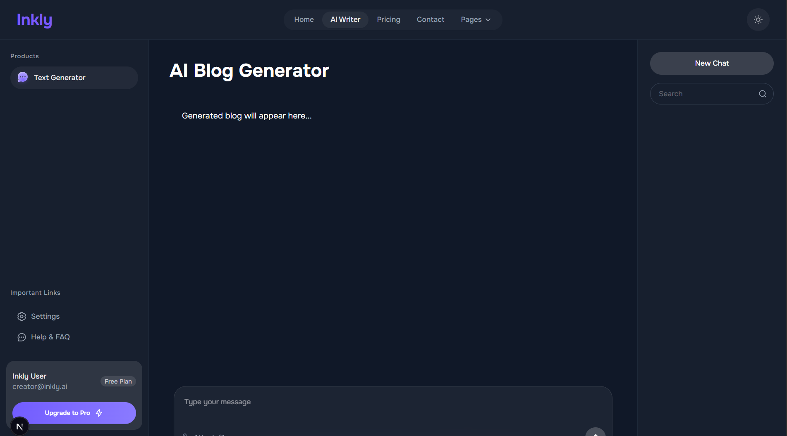
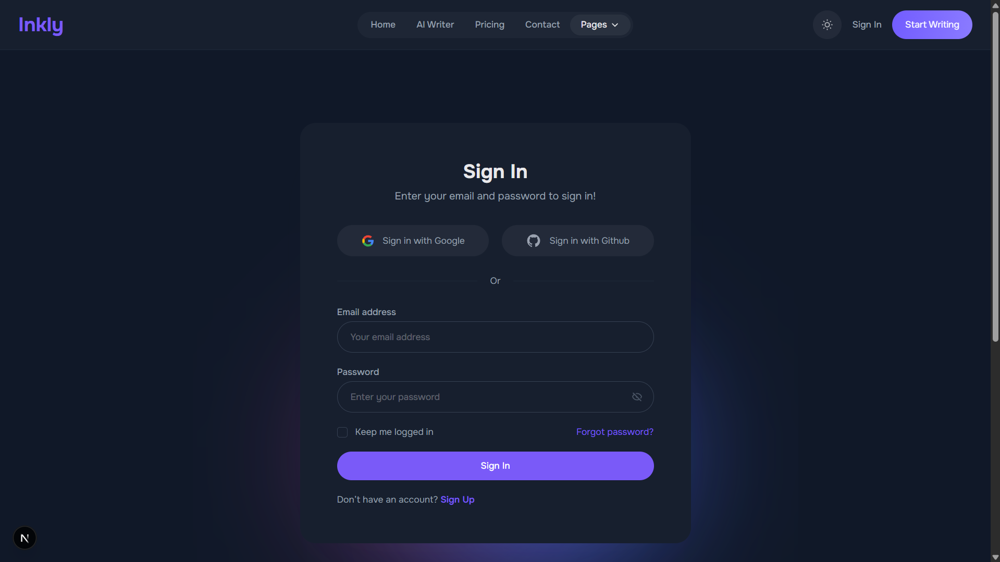
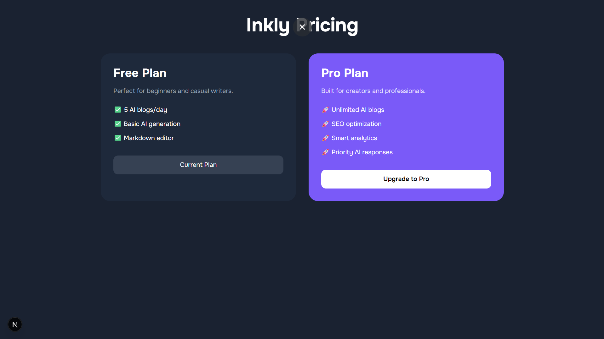

<div align="center">

<br/>

```
 ██╗███╗   ██╗██╗  ██╗██╗  ██╗   ██╗
 ██║████╗  ██║██║ ██╔╝██║  ╚██╗ ██╔╝
 ██║██╔██╗ ██║█████╔╝ ██║   ╚████╔╝ 
 ██║██║╚██╗██║██╔═██╗ ██║    ╚██╔╝  
 ██║██║ ╚████║██║  ██╗███████╗██║   
 ╚═╝╚═╝  ╚═══╝╚═╝  ╚═╝╚══════╝╚═╝   
```

### AI-Powered Blogging Platform

*Write smarter. Rank higher. Grow faster.*

> *"Blogs, powered by intelligence."*

<br/>

[](https://nextjs.org/)
[](https://www.typescriptlang.org/)
[](https://nodejs.org/)
[](https://www.mongodb.com/)
[](https://groq.com/)
[](LICENSE)

<br/>

[**Report Bug**](https://github.com/krithik336/inkly-blogging-platform/issues) · [**Request Feature**](https://github.com/krithik336/inkly-blogging-platform/issues)

</div>

---

## Overview

**Inkly** is a full-stack, AI-powered blogging platform that transforms the way creators produce content. By combining the power of **Groq's LLM API** with a modern MERN architecture, Inkly enables writers to generate, edit, and publish SEO-optimized blog content in a fraction of the traditional time.

Built as a SaaS-inspired product with clean architecture, Inkly demonstrates real-world full-stack engineering — from JWT-secured authentication to AI-assisted content pipelines — making it a strong showcase of modern web development practices.

<br/>

## Features

| Feature | Description |
|---|---|
| ✨ **AI Content Generation** | Leverages Groq API to generate high-quality, context-aware blog content in seconds |
| 🔍 **SEO Optimization** | Built-in suggestions for meta descriptions, keywords, and content structure |
| 📊 **Content Analytics** | Smart insights to track content performance and engagement metrics |
| 🔐 **JWT Authentication** | Secure user authentication and session management using JSON Web Tokens |
| 💳 **Subscription Interface** | Monetization-ready UI for managing plans and premium access |
| 🌙 **Dark Mode UI** | Fully responsive, modern interface with dark mode support |
| ⚡ **Scalable Architecture** | Clean, modular codebase designed for production scalability |

<br/>

## Tech Stack

```
┌─────────────────────────────────────────────────────────┐
│                        INKLY                            │
├──────────────────┬──────────────────┬───────────────────┤
│    FRONTEND      │     BACKEND      │   AI INTEGRATION  │
├──────────────────┼──────────────────┼───────────────────┤
│  Next.js 15      │  Node.js         │  Groq API         │
│  React.js        │  Express.js      │  LLM Pipeline     │
│  TypeScript      │  MongoDB         │  Prompt Engine    │
│  Tailwind CSS    │  Mongoose        │  SEO Generator    │
└──────────────────┴──────────────────┴───────────────────┘
```

<br/>

## Project Structure

```bash
inkly-blogging-platform/
│
├── 📁 frontend/
│   ├── 📁 src/
│   │   ├── 📁 app/            # Next.js App Router pages
│   │   ├── 📁 components/     # Reusable UI components
│   │   ├── 📁 hooks/          # Custom React hooks
│   │   └── 📁 lib/            # Utility functions & API clients
│   ├── 📁 public/             # Static assets
│   └── 📄 package.json
│
└── 📁 backend/
    ├── 📁 controllers/        # Request handlers & business logic
    ├── 📁 routes/             # API route definitions
    ├── 📁 models/             # Mongoose data models
    ├── 📁 middleware/         # Auth, error handling middleware
    ├── 📄 server.js           # Express server entry point
    └── 📄 package.json
```

<br/>

## Getting Started

### Prerequisites

Before you begin, ensure you have the following installed:

- **Node.js** v18+ — [Download](https://nodejs.org/)
- **MongoDB** — Local instance or [MongoDB Atlas](https://www.mongodb.com/atlas)
- **Groq API Key** — [Get yours here](https://console.groq.com/)

---

### 1. Clone the Repository

```bash
git clone https://github.com/krithik336/inkly-blogging-platform.git
cd inkly-blogging-platform
```

### 2. Configure Environment Variables

Create a `.env` file inside the `/backend` directory:

```env
# ──────────────────────────────────
#  Inkly – Backend Environment Config
# ──────────────────────────────────

MONGO_URI=your_mongodb_connection_string
GROQ_API_KEY=your_groq_api_key
JWT_SECRET=your_secure_jwt_secret
```

> ⚠️ **Never commit your `.env` file.** It is already listed in `.gitignore`.

---

### 3. Start the Backend

```bash
cd backend
npm install
node server.js
```

> Backend runs at `http://localhost:5000`

---

### 4. Start the Frontend

```bash
cd frontend
npm install
npm run dev
```

> Frontend runs at `http://localhost:3000`

<br/>

## API Overview

| Method | Endpoint | Description |
|---|---|---|
| `POST` | `/api/auth/register` | Register a new user |
| `POST` | `/api/auth/login` | Authenticate and receive JWT |
| `POST` | `/api/blog/generate` | Generate AI blog content via Groq |
| `GET` | `/api/blog/:id` | Retrieve a specific blog post |
| `PUT` | `/api/blog/:id` | Update a blog post |
| `DELETE` | `/api/blog/:id` | Delete a blog post |

<br/>

## Roadmap

The following enhancements are planned for upcoming releases:

- [ ] **Rich Text Editor** — WYSIWYG editor alongside markdown
- [ ] **Blog Publishing Dashboard** — Manage, schedule, and publish posts
- [ ] **User Profile Management** — Customizable author profiles
- [ ] **Analytics Dashboard** — Deep-dive content performance insights
- [ ] **Payment Gateway Integration** — Stripe-powered subscription billing
- [ ] **Blog Export & Sharing** — Export to PDF, share to social platforms
- [ ] **Multi-language Support** — AI content generation in multiple languages

<br/>

## Screenshots

### 🏠 Home / Landing Page


### ✨ AI Blog Generator


### 🔐 Authentication


### 💳 Pricing


<br/>

## Author

<div align="center">

**Kirthik**

[](https://github.com/krithik336)

</div>

---

<div align="center">

**If you find this project useful, please consider giving it a ⭐ — it helps a lot!**

<br/>

*© 2026 Inkly · Developed for educational and learning purposes*

</div>
